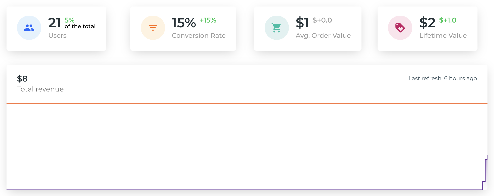

# Activity

## What is an activity?

An activity represents anything you do that has an impact on your product. This could be your next feature, the translation of your website in a new language, a marketing campaign, or anything you want to measure over time.

Examples of Activities:

- New SEO strategy
- Facebook campaign
- French translation
- New features
- New landing page
- New product page
- Launch of a new product

## Target

A Target, or segment, is a subset of user that will be affected by your activity.

!>If you don't set a Target, Smoothix will automatically split your userbase with the Period Start to do a Before/After comparison.

We recommend setting a Target to get better data. Furthermore, it is good practice to ask yourself what specific kind of users you are targetting. And there are plenty of filters available in Smoothix for that!

?> You can use **utm\_\*** query parameters to easily filter your users from your different campaigns. [Learn more](https://support.google.com/analytics/answer/1033863?hl=en)

Examples of Targets:

- If you do a Facebook campaign, your Target would be `Source equals "facebook.com"`
- If you created a new feature, your Target would be `Page equals "/my-new-feature"`
- If you translated your website in French, your Target would be `Language equals "French"`

## Goal

An Activity Goal is the **why** you are doing this activity. At Smoothix, we think that everything you are doing needs to answer these questions:

- What Goal do I want to improve? Do I want more user to login? To purchase? To read a blog article?
- What metric am I focusing? Do I want to attract more visitors? Do I want to improve my conversion rate? Do I want buyers to make bigger purchases? Do I want my users to come back?

## Budget

This the cost of your activity both in hours and expenses. It does not need to be super precise but should give you a rough idea of how much you spent on your activity to be able to compare it with others.

## Metrics

There are 4 KPI representing crucial indications about your business. The variation number is the comparison with the rest of your userbase.

- **Users**: The number of users affected by your activity. You don't want it to be equal to 0% of your total userbase but you generally don't want it be equal to 100% either expect if you made a change that affected everyone.
- **Conversion Rate**: The number of users that fulfilled your Goal over the total number of users.
- **Avg. Order Value**: The average value spent by your users.

?>Use dynamic value with [Events](https://support.google.com/analytics/answer/1033068) or [Ecommerce Tracking](https://support.google.com/analytics/answer/1009612?hl=en) to correctly track this.

- **Lifetime Value**: The value spent by the returning visitors.

The chart represents the evolution of your revenue and cost over time and let you clearly see the Return on Investment and the Break-event Point.
