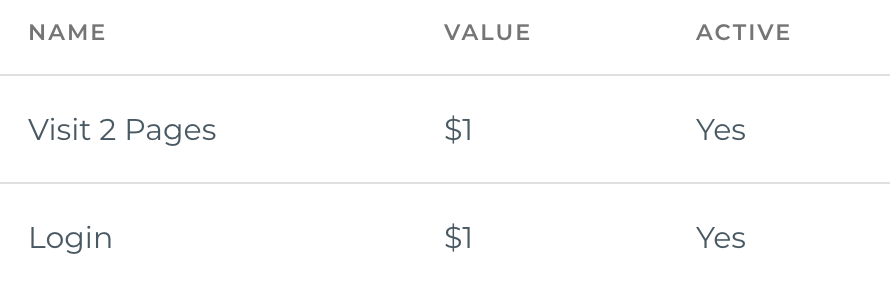

# Goal

## What is a Goal?

?>Use goals to measure how often users complete specific actions.

Goals measure how well your site or app fulfills your target objectives. A goal represents a completed activity, called a conversion, that contributes to the success of your business. Examples of goals include making a purchase (for an ecommerce site), completing a game level (for a mobile gaming app), or submitting a contact information form (for a marketing or lead generation site).

Defining goals is a fundamental component of any digital analytics measurement plan. Having properly configured goals allows Analytics to provide you with critical information, such as the number of conversions and the conversion rate for your site or app. Without this information, it's almost impossible to evaluate the effectiveness of your online business and marketing campaigns.

[Learn more](https://support.google.com/analytics/answer/1012040?hl=en)

## Best practices

Generally speaking, company websites fit into three core categories — ecommerce, lead generation, and content — each of which has a target objective:

1. Ecommerce Website: Goal is for users to buy something.
2. Lead Generation Website: Goal is for users to complete a form.
3. Content Website: Goal is for users to sign up to receive content (email lists, RSS feeds, etc.) or engage with the brand community (add comments, share content, complete surveys, etc).

Once you’ve identified the overarching objective for your website, it’s easy to figure out how to measure your progress with Google Analytics goals.

The three main types of Google Analytics goals are:

1. Destination Goals: Destination goals allow you to track when visitors reach a particular page or set of pages on your website. Common examples include tracking when visitors reach “thank you,” “order completed,” or “add to cart” pages.
2. Engagement Goals: Engagement goals allow you to track on-site activity, such as the amount of time visitors spend on your site, how many pages they visit, and what actions they take.
3. Event Goals: Event goals allow you to track when visitors perform an action on your site, such as watching a video, sharing a post on social media, or clicking an ad.

[Learn more](https://trackmaven.com/blog/google-analytics-goals-business-website/)
