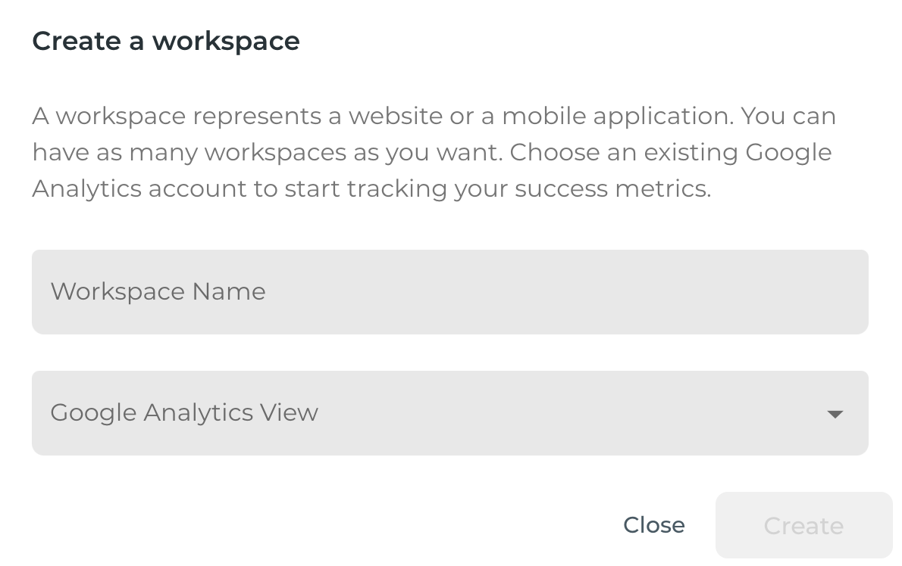
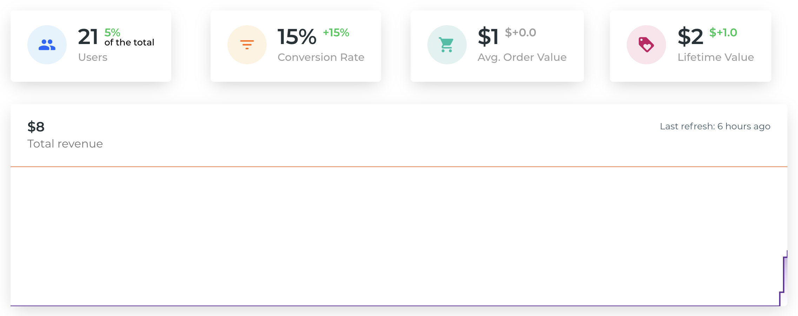

# Quickstart

## Setup Google Analytics

Smoothix is based on Google Analytics API. You need to have a Google Analytics account. You will be asked to give us the read permission over your data when you subscribe.

[Get started with Google Analytics](https://support.google.com/analytics/answer/1008015?hl=en)

!> Make sure to login with the same Google account as your Google Analytics one.

## Create your first workspace

A workspace represents any project you track over Google Analytics. For example, your website or mobile application.

Give it a name and link it to an existing Google Analytics view and you are ready to go.

## Set up your goals

Every KPI computed by Smoothix is based around Goals. Why? Because it is a good way for you to objectivate the impact of your work. [Learn more about Goals best practices](goal?id=best-practices)

In Google Analytics, goals are defined by several attributes:

- **Name:** A custom name. E.g. Login, Purchase...
- **Fulfillment condition:** The condition that will make your Goal count increase. E.g. Visitors that viewed page "/login".
- **Value:** Your estimated revenue when the Goal is fulfilled. It can be a constant or dynamic value using [Events](https://support.google.com/analytics/answer/1033068). E.g. \$10.

We strongly advise putting a value for each Goal since they are used by Smoothix to compute your Revenue. It does need to be _real_ money and can be a prediction or a scale. E.g. if you know that after subscribing, your users have a 10% conversion rate to spend $100 on your website, then your Goal Value would be $10.

## Setup your first activity

An activity represents anything you do that has an impact on your product. This could be your next feature, the translation of your website in a new language, a marketing campaign, or anything you want to measure over time. [Learn more about Activities](activity)

Create your first activity by giving it:

- **Name:** A custom name. E.g. Emailing Campaign, New Product, Awesome Feature...
- **Period:** The start and end date of your activity.
- **Target:** The users you are targetting. E.g. if you are translating your website to French, you want to filter only the people speaking French for your KPI.
- **Goal:** Which Goal you are trying to improve and how. E.g. I want to improve my **Login** page **Conversion Rate**.

