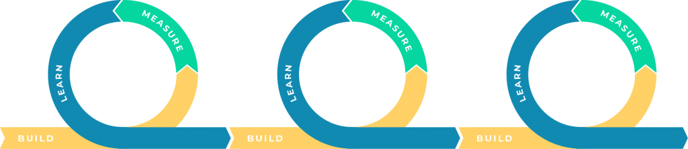

# Why we made Smoothix

Simple: we want **Analytics for Humans**.

## A brief history

Smoothix was inspired by the Lean Startup methodology and implementing the Build-Measure-Learn feedback loop. [Learn more](https://en.wikipedia.org/wiki/Lean_startup#Build-Measure-Learn)

## What problem are we solving?

There are a lot of analytics tools and they are powerful. Google Analytics, Mixpanel, Tableau, Looker... You can do so many things with them!

However, the learning curve can be kind of scary sometimes. It looks easy but is hard to master and often becomes a source of frustration.

Smoothix is here to close the loop between your product and marketing teams and your data by linking operations with analytics.

## Who is behind Smoothix?

We are a small team of humans living in San Francisco, CA. We come from different backgrounds (data, product, design...) but we agree on two things:

1. We love great products and we want to help everyone improve the quality of their product.

2. We think that data and measurement are crucial in this process.

This is why we made Smoothix and we hope you will enjoy it as much as we enjoyed making it!
