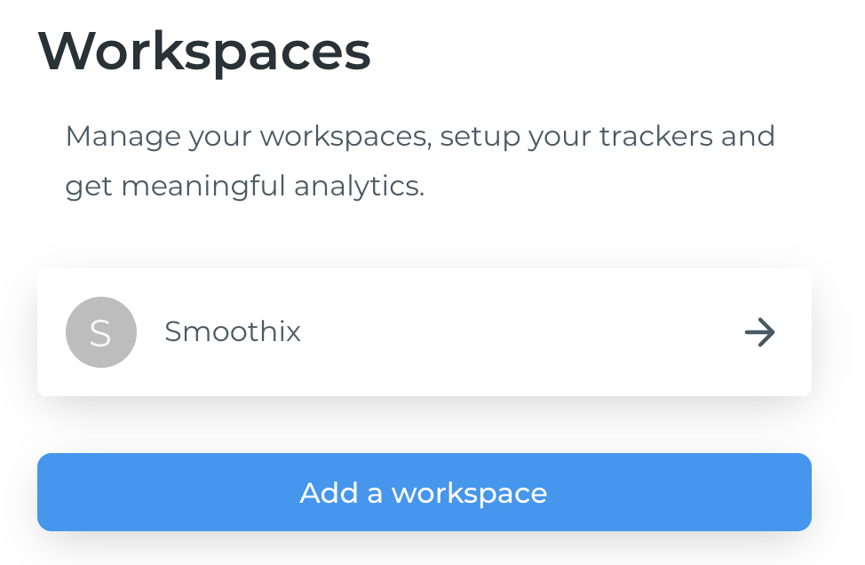

# Workspace

## What is a workspace?

A workspace represents any project you track over Google Analytics. For example, your website or mobile application.

This is the starting point when you first log in to your Smoothix account. You can track different sources and collaborate through the workspaces.

